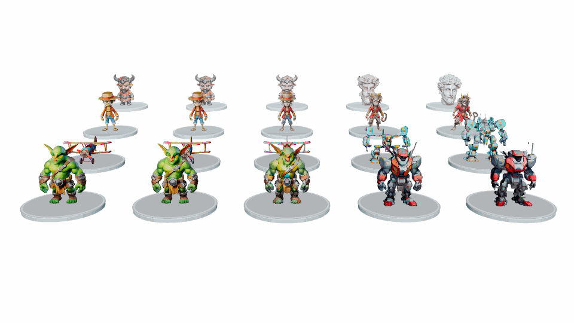

# ReinMorph3D: Harnessing the Power of Structured Latent for Stable 3D Morphing

<!-- TODO: Replace placeholders with the final author list, affiliations, and paper links. -->
**Authors:** Xintao Wang, Linmao Li, Wenrui Li, Hengyu Man, Wangmeng Zuo, Xiaopeng Fan  <br>
**Affiliations:** Institution / Lab  

[Project Page](https://linimor.github.io/reinmorph_page/#) | [Paper](#) | [Code](https://github.com/linimor/ReinMorph3D)

## Overview

ReinMorph3D is a research project for stable 3D morphing through structured latent representations. This repository builds on a TRELLIS-based image-to-3D pipeline and provides examples for 3D morphing, disentangled morphing, dual-target morphing, and 3D style transfer.

## Gallery



## Installation

Tested on **Ubuntu 20.04**, **Python 3.10**, **NVIDIA GTX4090**, **CUDA 11.8**, and **PyTorch 2.4.0**. Follow the steps below to set up the environment.

1. Clone the repo:

    ```bash
    git clone https://github.com/linimor/ReinMorph3D.git
    cd ReinMorph3D
    ```

2. Setup the environment:

    As ReinMorph3D builds upon [TRELLIS](https://github.com/microsoft/TRELLIS), you can find more details about the dependencies in the TRELLIS repository.

    ```bash
    bash ./setup.sh --new-env --basic --xformers --flash-attn --diffoctreerast --spconv --mipgaussian --kaolin --nvdiffrast
    conda install https://anaconda.org/pytorch3d/pytorch3d/0.7.8/download/linux-64/pytorch3d-0.7.8-py310_cu118_pyt240.tar.bz2 # Note: Please ensure the pytorch3d version matches your Python, CUDA and Torch versions
    ```

3. Download pretrained models:

    We do not modify the pretrained models of TRELLIS. The weights will be automatically downloaded when you run:

    ```python
    TrellisImageTo3DPipeline.from_pretrained("microsoft/TRELLIS-image-large")
    ```

    Optionally, you can manually download the weights from [HuggingFace](https://huggingface.co/microsoft/TRELLIS-image-large) and change the path in the above command to the local path.

    ```python
    TrellisImageTo3DPipeline.from_pretrained("path/to/local/directory")
    ```

## Inference

```bash
# 3D Morphing
python ./example_3Dmorphing.py
```

## Application

```bash
# Disentangled 3D Morphing
python ./example_disentangled_3Dmorphing.py
# Dual-Target 3D Morphing
python ./example_dual_target_3Dmorphing.py
# 3D Style Transfer
python ./example_3Dstyle_transfer.py
```

## Citation

```bibtex
@article{reinmorph3d,
  title   = {ReinMorph3D: Harnessing the Power of Structured Latent for Stable 3D Morphing},
  author  = {Xintao Wang, Linmao Li, Wenrui Li, Hengyu Man, Wangmeng Zuo, Xiaopeng Fan},
  journal = {TODO},
  year    = {2026}
}
```

## Acknowledgements

This code builds upon [TRELLIS](https://github.com/microsoft/TRELLIS).
We sincerely thank the authors for their great work and open-sourcing the code.
